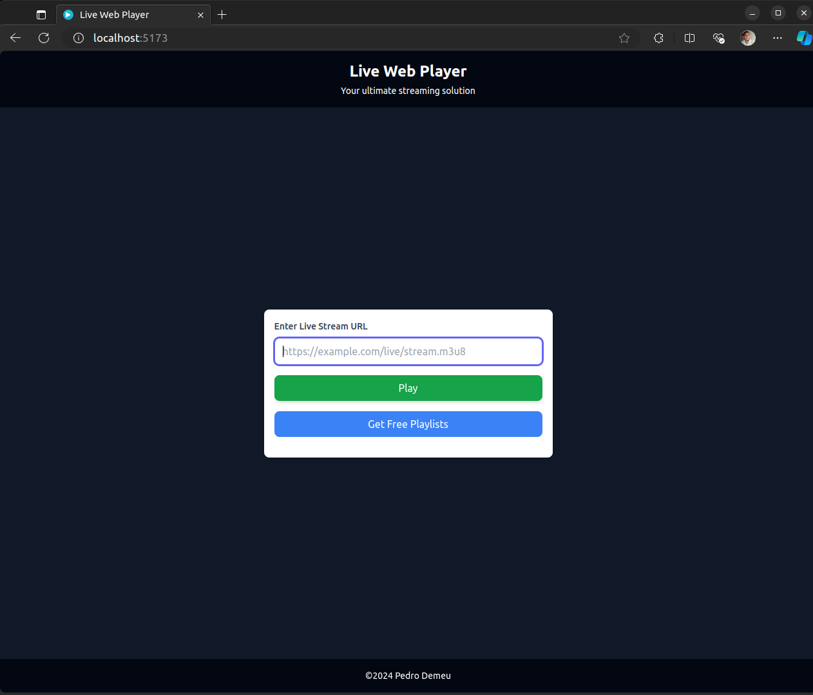
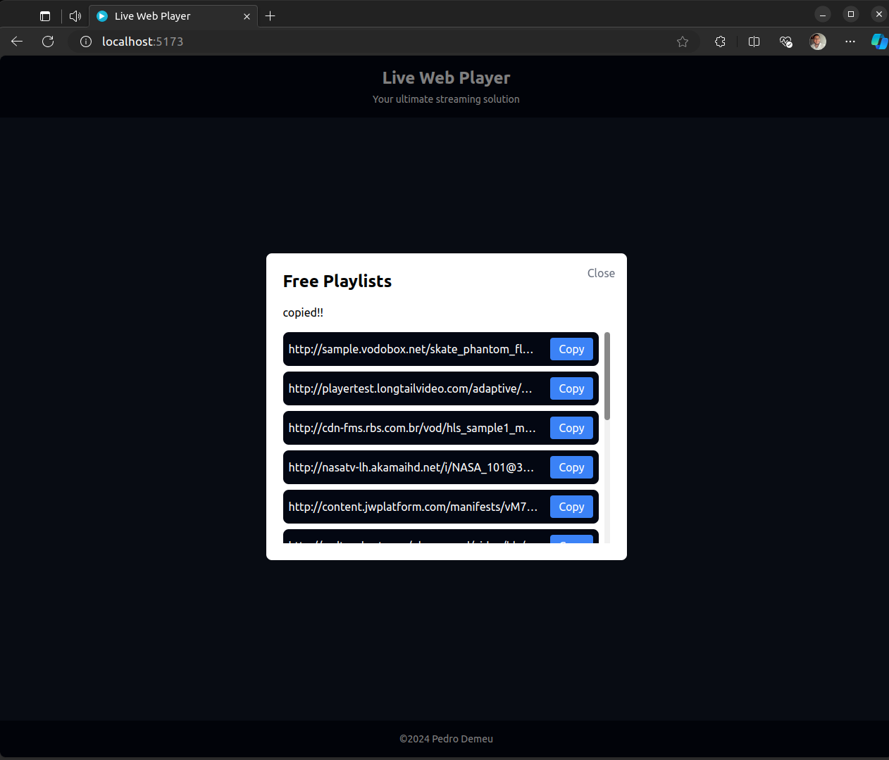
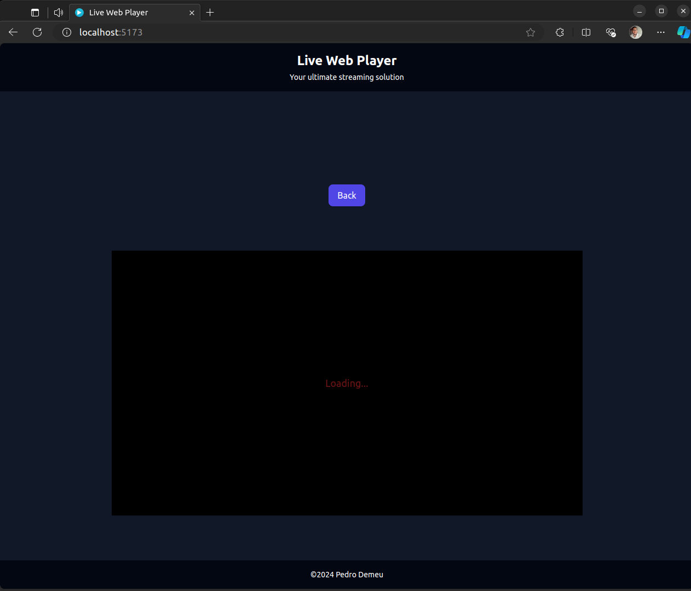
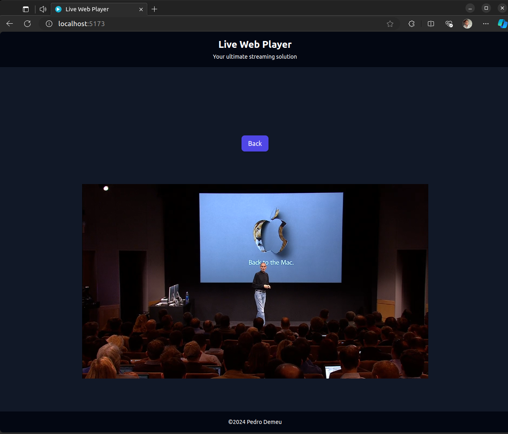

## Video Player Application

**This application is a simple video player built using React and Video.js, designed to play HLS streams.** 
It allows users to input a video URL and start playing the video with basic controls.

### Aparence
  
  
  
  

### Features

* **Video Player:** Utilizes Video.js for seamless playback of HLS streams.
* **Error Handling:** Handles errors during video playback and retries if necessary.
* **Responsive Design:** Supports responsive layouts for different screen sizes.
* **Clipboard Copy:** Allows users to copy video URLs easily. (Consider adding a "Copy" icon here)

---

### Installation

- Clone the repository.
- Install dependencies with ``yarn install``.
- Start the development server with ``yarn dev``.
- Open http://localhost:3000 in your browser (edge recommended).

---

### Usage

``You can use Free Playlists available``
- Enter a valid HLS video URL in the input field.
- Click "Play" to start streaming the video.

---

**Technologies Used**
* React
* Video.js V8 (support HLS 😃)

**Contributing**
Contributions are welcome! Fork the repository and submit a pull request with your enhancements.

**Observations**
Some playlists may be publicly accessible and could be removed in the future. If any playlist fails to load, please try another or use your own m3u8 playlist.